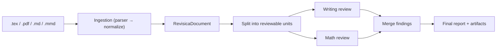
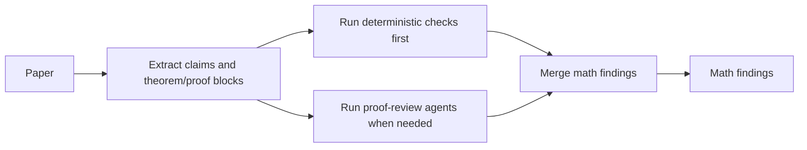
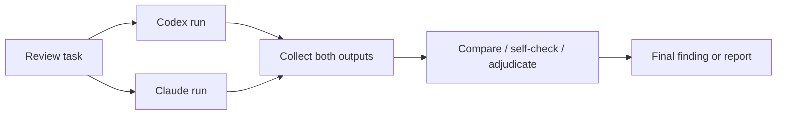

# Revisica Current Architecture

This document is written for explanation, not for implementation detail.

## What Revisica Does

Revisica reviews academic papers by turning one large draft into smaller, checkable units, sending those units through the right review paths, and then merging the results into a final report. It accepts `.tex`, `.pdf`, `.md`, and `.mmd` input — all formats are converted to a common `RevisicaDocument` through the ingestion layer.

The key idea is simple:

`any format → ingestion → RevisicaDocument → split into units → specialized review → merge findings → report`

## Executive View

## Runtime Data Flow

```mermaid
flowchart LR
    INPUT["Input file (.tex/.pdf/.md/.mmd)"] --> PARSE["Parser (pandoc/tex/mineru/marker/mathpix/markdown)"]
    PARSE --> MD["Raw Markdown + LaTeX math"]
    MD --> NORM["normalize_to_document()"]
    NORM --> DOC["RevisicaDocument (sections + metadata)"]
    DOC --> CHUNK["Chunk into sections, claims, theorem/proof blocks"]
    CHUNK --> PATHS["Send each unit to the right review path"]
    PATHS --> FINDINGS["Collect findings"]
    FINDINGS --> FILTER["Optional self-check / adjudication"]
    FILTER --> OUTPUT["Write final report and intermediate artifacts"]
    OUTPUT --> STOP["Stop"]
```

## What Gets Split

Revisica does not review the whole paper as one blob. It first creates smaller units that are easier to inspect well.

- Writing-oriented units such as sections or section combinations
- Mathematical claims that can be checked locally
- Theorem and proof blocks that need proof review

This makes the review more precise and lets different checkers focus on different failure modes.

## The Two Main Paths

### Writing Path

The writing path looks for issues such as clarity, structure, venue fit, notation drift, and formula presentation.

### Math Path

The math path separates objective checks from harder reasoning. Simple verifiable claims can be checked deterministically. Proof blocks can then go to model-based reviewers if deeper reasoning is needed.

## Why The Architecture Looks Like This

Revisica is built around a few practical strategies.

- Decompose first.
  Smaller units are easier to inspect accurately than one long paper prompt.

- Separate writing review from math review.
  These are different problem types and should not be forced through one generic reviewer.

- Use deterministic checks before LLM reasoning.
  If something can be verified cheaply and objectively, do that first.

- Use specialists instead of one general reviewer.
  Different agents can focus on different failure modes.

- Preserve intermediate artifacts.
  The final report matters, but the intermediate outputs matter too because they show where findings came from.

- Add filtering only where it helps.
  Self-check and adjudication are used to reduce false positives, not to create an endless loop.

## Codex And Claude

Revisica can use both Codex and Claude in the same workflow.

This is workflow-level collaboration.

- Revisica can send the same task to both providers.
- Their outputs are stored separately.
- The system can compare them, cross-check them, or use one provider to adjudicate over both.
- Codex and Claude are not directly chatting with each other.

## When A Run Stops

A single run is finite.

1. Read the file.
2. Split it into reviewable units.
3. Run the selected review paths.
4. Collect and filter findings.
5. Write artifacts and the final report.
6. Exit.

If you see a circle in a high-level diagram, it should mean benchmark feedback across runs, not an infinite live loop inside one run.

## What The “Smart” Part Is

The smartness is not one magical prompt. It comes from orchestration.

- Give each checker a smaller and better-scoped input.
- Use different review logic for writing and math.
- Let deterministic methods handle what they can.
- Use multiple specialists instead of a single monolithic reviewer.
- Use provider disagreement as useful signal.
- Keep the whole run inspectable by saving artifacts.
- Use benchmark results to improve future runs.

## Code-Level Mapping

If someone wants to connect this explanation back to the code:

- `cli.py`: entrypoints
- `ingestion/`: multi-format input layer (parsers + normalize → `RevisicaDocument`)
  - `registry.py`: auto-detection with local-first PDF ordering
  - `markdown_parser.py`, `mineru_parser.py`, `mathpix_parser.py`, `pandoc_parser.py`, `tex_parser.py`, `marker_parser.py`
  - `normalize.py`: raw Markdown → sections + metadata
- `unified_review.py`: top-level combined workflow
- `writing_review.py`: writing review orchestration
- `math_review.py`: math review orchestration
- `review.py`: shared provider execution layer
- `math_check/`: pure math pipeline (types, extraction, deterministic analysis, artifact rendering)
- `math_llm/`: LLM-based proof review (review, task, parse modules)
- `eval/`: benchmarking and evaluation framework (math, writing, refine, HF dataset adapters)
- `api.py`: FastAPI server (`/api/ingest`, `/api/review`, `/api/providers`, etc.)
- `core_types.py`, `adjudication_policy.py`: shared infrastructure
